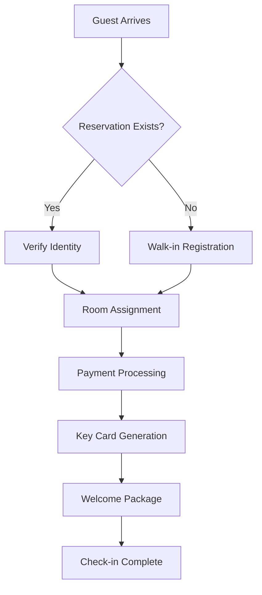
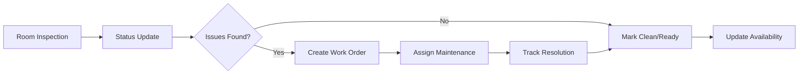

# Hotel Core Operations UI/UX Design Documentation

## Executive Summary

This document defines the comprehensive visual design system and user experience framework for the Hotel Operations Hub platform. The design system creates a cohesive, accessible, and brandable interface that supports the multi-tenant, white-labeled architecture while providing exceptional usability for hotel staff across all operational modules.

**Design Philosophy**: Luxury Simplicity - Create interfaces that feel premium yet remain highly functional for daily operational use.

**Core Principles**:
- **Efficiency First**: Every interaction should reduce clicks and cognitive load
- **Brand Flexibility**: Support complete white-labeling while maintaining usability
- **Mobile-First**: Responsive design optimized for tablets and phones
- **Accessibility Built-In**: WCAG AA compliance as a foundation
- **Data Density**: Display rich information without overwhelming users

---

## Visual Design System

### Color Architecture

#### Primary Color System
The platform uses a sophisticated color hierarchy that supports both light and dark themes while maintaining brand flexibility:

```css
/* Primary Brand Colors */
--color-primary-50: #faf7f0;   /* Lightest tint */
--color-primary-100: #f5ebd7;  /* Base sand color */
--color-primary-200: #ead5b8;
--color-primary-300: #ddbf99;
--color-primary-400: #d0a97a;
--color-primary-500: #aa8e67;  /* Core brand color */
--color-primary-600: #987d5a;
--color-primary-700: #7a634b;
--color-primary-800: #5c4a38;
--color-primary-900: #3e3125;  /* Darkest shade */

/* Secondary Accent Colors */
--color-secondary-500: #7c8e67;  /* Forest Green */
--color-accent-teal: #a4c4c8;    /* Ocean Teal */
--color-accent-sky: #dcfef4;     /* Sky Blue */
--color-accent-coral: #ec6c4b;   /* Terracotta */
--color-accent-lilac: #dccedc;   /* Soft Lilac */
--color-accent-aqua: #6a8ecf;    /* Deep Aqua */

/* Semantic Colors */
--color-success: #10b981;
--color-warning: #f59e0b;
--color-error: #ef4444;
--color-info: #3b82f6;

/* Neutral Scale */
--color-gray-50: #f9fafb;
--color-gray-100: #f3f4f6;
--color-gray-200: #e5e7eb;
--color-gray-300: #d1d5db;
--color-gray-400: #9ca3af;
--color-gray-500: #6b7280;
--color-gray-600: #4b5563;
--color-gray-700: #374151;
--color-gray-800: #1f2937;
--color-gray-900: #111827;
```

#### Contextual Color Usage

**Room Status Color Coding**:
```css
--room-available: #10b981;     /* Clean, ready for guests */
--room-occupied: #3b82f6;      /* Currently occupied */
--room-dirty: #f59e0b;         /* Needs housekeeping */
--room-maintenance: #ef4444;   /* Out of order */
--room-blocked: #6b7280;       /* Administratively blocked */
--room-checkout: #8b5cf6;      /* Guest checked out, cleaning needed */
```

**Priority Indicators**:
```css
--priority-urgent: #dc2626;    /* Red - immediate attention */
--priority-high: #ea580c;      /* Orange - same day */
--priority-medium: #ca8a04;    /* Yellow - this week */
--priority-low: #65a30d;       /* Green - when convenient */
```

### Typography System

#### Font Hierarchy
```css
/* Font Families */
--font-heading: 'Gotham Black', 'Tahoma', sans-serif;
--font-subheading: 'Georgia', serif;
--font-body: 'Proxima Nova', 'Arial', sans-serif;
--font-mono: 'SF Mono', 'Monaco', monospace;

/* Type Scale (Mobile-First) */
--text-xs: 0.75rem;    /* 12px - Captions, timestamps */
--text-sm: 0.875rem;   /* 14px - Secondary information */
--text-base: 1rem;     /* 16px - Body text */
--text-lg: 1.125rem;   /* 18px - Emphasis */
--text-xl: 1.25rem;    /* 20px - Card titles */
--text-2xl: 1.5rem;    /* 24px - Section headers */
--text-3xl: 1.875rem;  /* 30px - Page titles */
--text-4xl: 2.25rem;   /* 36px - Hero headlines */

/* Line Heights */
--leading-tight: 1.25;
--leading-normal: 1.5;
--leading-relaxed: 1.75;

/* Font Weights */
--font-light: 300;
--font-normal: 400;
--font-medium: 500;
--font-semibold: 600;
--font-bold: 700;
--font-black: 900;
```

#### Typography Usage Guidelines

**Headers**:
- Page Titles: Gotham Black, 30px, all caps, generous spacing
- Section Headers: Gotham Black, 24px, title case
- Card Titles: Proxima Nova Semibold, 20px

**Body Text**:
- Default: Proxima Nova Regular, 16px, 1.5 line height
- Secondary: Proxima Nova Light, 14px, gray-600
- Captions: Proxima Nova Regular, 12px, gray-500

**Interactive Elements**:
- Buttons: Proxima Nova Semibold, 14-16px depending on size
- Links: Proxima Nova Medium, underline on hover
- Form Labels: Proxima Nova Semibold, 14px

### Spacing System

#### 8px Grid System
```css
--spacing-1: 0.25rem;  /* 4px - Tight elements */
--spacing-2: 0.5rem;   /* 8px - Default small */
--spacing-3: 0.75rem;  /* 12px - Medium tight */
--spacing-4: 1rem;     /* 16px - Default medium */
--spacing-5: 1.25rem;  /* 20px - Medium loose */
--spacing-6: 1.5rem;   /* 24px - Section spacing */
--spacing-8: 2rem;     /* 32px - Large spacing */
--spacing-10: 2.5rem;  /* 40px - Extra large */
--spacing-12: 3rem;    /* 48px - Hero spacing */
--spacing-16: 4rem;    /* 64px - Section breaks */
```

#### Component Spacing Guidelines

**Cards**: 24px padding, 16px margin between cards
**Forms**: 20px between field groups, 12px between fields
**Navigation**: 16px horizontal padding, 12px vertical
**Buttons**: 16px horizontal, 12px vertical (medium), scale proportionally

---

## Component Design Library

### Navigation Components

#### Top Navigation Bar
```typescript
interface TopNavProps {
  brand: BrandConfig;
  user: User;
  properties: Property[];
  activeProperty: Property;
  notifications: Notification[];
}
```

**Design Specifications**:
- Height: 64px (desktop), 56px (mobile)
- Background: White with subtle shadow
- Logo: Max height 40px, responsive
- User avatar: 32px circle with status indicator
- Property selector: Dropdown with search
- Notification bell: Badge with count

**Interaction States**:
- Hover: Subtle background color change
- Active: Border-bottom indicator
- Focus: Keyboard outline following brand colors

#### Sidebar Navigation
```typescript
interface SidebarProps {
  modules: EnabledModule[];
  collapsed: boolean;
  onToggle: () => void;
}
```

**Design Specifications**:
- Width: 280px expanded, 64px collapsed
- Background: Gray-50 with brand accent
- Icons: 24px with text labels
- Collapsible with smooth animation
- Active state with brand color highlight

**Mobile Adaptation**:
- Slide-out drawer on mobile
- Full-height overlay
- Touch gestures for navigation

### Data Display Components

#### Dashboard Metric Cards
```typescript
interface MetricCardProps {
  title: string;
  value: string | number;
  change?: {
    value: number;
    trend: 'up' | 'down' | 'stable';
    period: string;
  };
  icon?: React.ComponentType;
  color?: 'primary' | 'success' | 'warning' | 'error';
}
```

**Visual Design**:
- Card: 16px border radius, soft shadow
- Padding: 24px all sides
- Icon: 32px, brand colored
- Value: 2xl font size, bold
- Trend: Color-coded with arrow icons
- Responsive grid layout

#### Room Status Grid
```typescript
interface RoomGridProps {
  rooms: Room[];
  viewMode: 'grid' | 'list';
  filters: RoomFilters;
  onRoomClick: (room: Room) => void;
}
```

**Grid Layout**:
- Card size: 120x80px (compact), 160x120px (comfortable)
- Room number: Bold, 18px
- Status indicator: Colored border and background
- Guest info: Truncated with tooltip
- Drag-and-drop for housekeeping assignments

**Status Visual Indicators**:
- Available: Green border, white background
- Occupied: Blue border, light blue background
- Dirty: Orange border, light orange background
- Maintenance: Red border, light red background

#### Calendar Components
```typescript
interface CalendarViewProps {
  view: 'month' | 'week' | 'day';
  reservations: Reservation[];
  rooms: Room[];
  onEventClick: (reservation: Reservation) => void;
  onSlotClick: (date: Date, room?: Room) => void;
}
```

**Calendar Design**:
- Header: Month/year with navigation arrows
- Grid: Clean lines, adequate spacing
- Events: Color-coded blocks with guest names
- Time slots: 15-minute increments for detailed view
- Responsive: Stack vertically on mobile

### Form Components

#### Input Fields
```css
.input-field {
  padding: 12px 16px;
  border: 1px solid var(--color-gray-300);
  border-radius: 8px;
  font-size: 16px;
  transition: all 0.2s ease;
}

.input-field:focus {
  outline: none;
  border-color: var(--color-primary-500);
  box-shadow: 0 0 0 3px rgba(170, 142, 103, 0.1);
}

.input-field:error {
  border-color: var(--color-error);
}
```

**Input Variants**:
- Text inputs: Standard styling with validation states
- Select dropdowns: Custom styled with search functionality
- Date pickers: Calendar popup with range selection
- File uploads: Drag-and-drop zones with progress

#### Check-in/Check-out Wizard
```typescript
interface CheckinWizardProps {
  reservation?: Reservation;
  steps: WizardStep[];
  currentStep: number;
  onStepChange: (step: number) => void;
  onComplete: (data: CheckinData) => void;
}
```

**Wizard Design**:
- Progress indicator: Step numbers with connecting lines
- Cards: Each step in a dedicated card
- Navigation: Previous/Next buttons, skip options
- Validation: Real-time field validation
- Summary: Review step before completion

### Interactive Components

#### Button System
```css
/* Primary Button */
.btn-primary {
  background: var(--color-primary-500);
  color: white;
  padding: 12px 24px;
  border-radius: 8px;
  font-weight: 600;
  transition: all 0.2s ease;
}

.btn-primary:hover {
  background: var(--color-primary-600);
  transform: translateY(-1px);
  box-shadow: 0 4px 8px rgba(0, 0, 0, 0.1);
}

/* Size Variants */
.btn-sm { padding: 8px 16px; font-size: 14px; }
.btn-md { padding: 12px 24px; font-size: 16px; }
.btn-lg { padding: 16px 32px; font-size: 18px; }
```

**Button Hierarchy**:
- Primary: Main actions (Check-in, Save, Submit)
- Secondary: Supporting actions (Cancel, Edit, View)
- Ghost: Minimal actions (Link-style buttons)
- Danger: Destructive actions (Delete, Remove)

#### Modal Dialogs
```typescript
interface ModalProps {
  isOpen: boolean;
  onClose: () => void;
  title: string;
  size: 'sm' | 'md' | 'lg' | 'xl' | 'full';
  children: React.ReactNode;
}
```

**Modal Design**:
- Backdrop: Semi-transparent dark overlay
- Container: White background, rounded corners
- Header: Title with close button
- Body: Scrollable content area
- Footer: Action buttons aligned right

---

## Page Layout Specifications

### Dashboard Layout

#### Executive Dashboard
```typescript
interface DashboardLayout {
  header: TopNavigation;
  sidebar: SidebarNavigation;
  main: {
    hero: HeroMetrics;
    insights: InsightCards[];
    quickActions: QuickActionGrid;
    recentActivity: ActivityFeed;
  };
}
```

**Layout Structure**:
```css
.dashboard-layout {
  display: grid;
  grid-template-areas: 
    "header header"
    "sidebar main";
  grid-template-columns: 280px 1fr;
  grid-template-rows: 64px 1fr;
  height: 100vh;
}

.dashboard-main {
  padding: 24px;
  overflow-y: auto;
  display: grid;
  gap: 24px;
  grid-template-columns: repeat(auto-fit, minmax(300px, 1fr));
}
```

**Hero Metrics Section**:
- 4-column grid on desktop, 2-column on tablet, 1-column on mobile
- Key performance indicators with trend arrows
- Quick access to detailed reports

#### Front Desk Operations
```typescript
interface FrontDeskLayout {
  leftPanel: {
    roomGrid: RoomStatusGrid;
    filters: RoomFilters;
  };
  centerPanel: {
    calendar: ReservationCalendar;
    timeline: TodayTimeline;
  };
  rightPanel: {
    guestInfo: GuestProfile;
    quickActions: FrontDeskActions;
  };
}
```

**Three-Panel Layout**:
- Left: 25% width - Room status overview
- Center: 50% width - Main calendar view
- Right: 25% width - Guest details and actions
- Responsive: Stack vertically on mobile

### Housekeeping Module

#### Room Status Board
```css
.housekeeping-board {
  display: grid;
  grid-template-columns: 200px 1fr;
  gap: 24px;
  height: calc(100vh - 64px);
}

.status-filters {
  background: white;
  border-radius: 12px;
  padding: 20px;
  box-shadow: 0 2px 4px rgba(0, 0, 0, 0.1);
}

.room-grid {
  display: grid;
  grid-template-columns: repeat(auto-fill, minmax(160px, 1fr));
  gap: 16px;
  padding: 20px;
  overflow-y: auto;
}
```

**Room Card Design**:
- Visual status indicators with color coding
- Drag-and-drop for staff assignments
- Guest information with privacy controls
- Priority indicators for urgent requests

### Maintenance Management

#### Work Order Dashboard
```typescript
interface MaintenanceLayout {
  toolbar: MaintenanceToolbar;
  kanban: WorkOrderKanban;
  calendar: MaintenanceCalendar;
  inspector: WorkOrderInspector;
}
```

**Kanban Board**:
- Columns: Requested, In Progress, Completed, Closed
- Cards: Draggable work orders with priority indicators
- Real-time updates with WebSocket connections
- Mobile: Horizontal scroll with snap points

---

## User Flow Diagrams

### Guest Check-in Process


**UI Flow Specifications**:
1. **Reservation Lookup**: Search field with guest name/confirmation
2. **Identity Verification**: Photo ID upload with validation
3. **Room Assignment**: Visual room selector with preferences
4. **Payment**: Secure payment form with multiple options
5. **Completion**: Summary page with room details and amenities

### Room Status Updates


**Housekeeping Interface**:
- Mobile-optimized checklist interface
- Photo documentation for issues
- One-tap status updates
- Voice notes for detailed reports

---

## Mobile Responsive Layouts

### Breakpoint System
```css
/* Mobile First Approach */
.container {
  padding: 16px;
}

/* Tablet Portrait */
@media (min-width: 768px) {
  .container {
    padding: 24px;
  }
}

/* Tablet Landscape */
@media (min-width: 1024px) {
  .container {
    padding: 32px;
  }
}

/* Desktop */
@media (min-width: 1280px) {
  .container {
    padding: 40px;
  }
}
```

### Mobile Navigation Patterns

#### Bottom Tab Navigation
```typescript
interface MobileTabsProps {
  tabs: {
    icon: React.ComponentType;
    label: string;
    route: string;
    badge?: number;
  }[];
  activeTab: string;
}
```

**Design Specifications**:
- Height: 80px with safe area padding
- Background: White with subtle top border
- Icons: 24px with active state animation
- Labels: 12px, truncated if needed
- Badge: Red circle with white text

#### Swipe Gestures
- Horizontal swipe: Navigate between main sections
- Vertical swipe: Refresh data, dismiss items
- Long press: Context menus and quick actions
- Pull-to-refresh: Standard iOS/Android patterns

### Touch-Optimized Components

#### Room Status Cards (Mobile)
```css
.room-card-mobile {
  min-height: 80px;
  padding: 16px;
  touch-action: manipulation;
  border-radius: 12px;
  margin-bottom: 12px;
}

.room-card-mobile:active {
  transform: scale(0.98);
  transition: transform 0.1s ease;
}
```

**Touch Targets**:
- Minimum size: 44x44px
- Spacing: 8px minimum between targets
- Feedback: Visual and haptic feedback for actions
- Accessibility: Voice-over support with descriptive labels

---

## Accessibility Guidelines

### WCAG AA Compliance

#### Color and Contrast
```css
/* Ensure minimum contrast ratios */
.text-primary { color: #1f2937; } /* 16.94:1 against white */
.text-secondary { color: #4b5563; } /* 7.59:1 against white */
.text-disabled { color: #9ca3af; } /* 4.58:1 against white */

/* Color is not the only indicator */
.status-indicator::before {
  content: attr(data-status);
  position: absolute;
  left: -10000px;
  top: auto;
  width: 1px;
  height: 1px;
  overflow: hidden;
}
```

#### Focus Management
```css
.focusable:focus {
  outline: 2px solid var(--color-primary-500);
  outline-offset: 2px;
}

/* Skip links */
.skip-link {
  position: absolute;
  top: -40px;
  left: 6px;
  background: var(--color-primary-500);
  color: white;
  padding: 8px;
  z-index: 100;
}

.skip-link:focus {
  top: 6px;
}
```

#### Screen Reader Support
```typescript
// Component with proper ARIA labels
const RoomCard: React.FC<RoomCardProps> = ({ room }) => (
  <div
    role="button"
    aria-label={`Room ${room.number}, ${room.status}, ${room.guestName || 'Available'}`}
    aria-pressed={room.selected}
    tabIndex={0}
  >
    <span aria-hidden="true">{room.number}</span>
    <span className="sr-only">
      {room.status} {room.guestName && `occupied by ${room.guestName}`}
    </span>
  </div>
);
```

### Keyboard Navigation
- Tab order: Logical flow through interactive elements
- Arrow keys: Navigate within component groups
- Enter/Space: Activate buttons and links
- Escape: Close modals and dropdowns
- Home/End: Navigate to first/last items in lists

---

## Animation and Interaction Patterns

### Micro-interactions

#### Loading States
```css
.loading-skeleton {
  background: linear-gradient(
    90deg,
    #f0f0f0 25%,
    #e0e0e0 50%,
    #f0f0f0 75%
  );
  background-size: 200% 100%;
  animation: loading 1.5s infinite;
}

@keyframes loading {
  0% { background-position: 200% 0; }
  100% { background-position: -200% 0; }
}
```

#### Button Animations
```css
.btn {
  transition: all 0.2s cubic-bezier(0.4, 0, 0.2, 1);
}

.btn:hover {
  transform: translateY(-2px);
  box-shadow: 0 4px 12px rgba(0, 0, 0, 0.15);
}

.btn:active {
  transform: translateY(0);
  transition-duration: 0.1s;
}
```

#### Status Transitions
```css
.room-status {
  transition: background-color 0.3s ease, border-color 0.3s ease;
}

.room-status.updating {
  animation: pulse 1.5s infinite;
}

@keyframes pulse {
  0%, 100% { opacity: 1; }
  50% { opacity: 0.5; }
}
```

### Page Transitions
```css
.page-enter {
  opacity: 0;
  transform: translateX(20px);
}

.page-enter-active {
  opacity: 1;
  transform: translateX(0);
  transition: opacity 300ms, transform 300ms;
}

.page-exit {
  opacity: 1;
}

.page-exit-active {
  opacity: 0;
  transform: translateX(-20px);
  transition: opacity 300ms, transform 300ms;
}
```

---

## Error and Empty States

### Error State Patterns

#### Form Validation Errors
```typescript
interface FieldErrorProps {
  error: string;
  field: string;
}

const FieldError: React.FC<FieldErrorProps> = ({ error, field }) => (
  <div className="field-error" role="alert" aria-live="polite">
    <AlertCircle className="w-4 h-4 text-error" />
    <span className="text-sm text-error">{error}</span>
  </div>
);
```

**Visual Design**:
- Red border on input field
- Error icon with descriptive text
- Immediate feedback on blur/change
- Clear instructions for resolution

#### Network Error States
```typescript
const NetworkError: React.FC = () => (
  <div className="error-state">
    <WifiOff className="w-16 h-16 text-gray-400 mx-auto mb-4" />
    <h3 className="text-lg font-semibold mb-2">Connection Lost</h3>
    <p className="text-gray-600 mb-4">
      Unable to connect to the server. Please check your internet connection.
    </p>
    <Button onClick={retry}>Try Again</Button>
  </div>
);
```

### Empty State Design

#### No Data Available
```typescript
const EmptyRooms: React.FC = () => (
  <div className="empty-state">
    <Bed className="w-20 h-20 text-gray-300 mx-auto mb-6" />
    <h3 className="text-xl font-semibold mb-3">No Rooms Found</h3>
    <p className="text-gray-600 mb-6">
      No rooms match your current filters. Try adjusting your search criteria.
    </p>
    <Button variant="outline" onClick={clearFilters}>
      Clear Filters
    </Button>
  </div>
);
```

**Empty State Guidelines**:
- Meaningful illustration or icon
- Clear explanation of why content is missing
- Actionable next steps for the user
- Consistent spacing and typography

---

## Loading and Skeleton Screens

### Progressive Loading Strategy

#### Component-Level Loading
```typescript
const RoomGrid: React.FC = () => {
  const { data: rooms, isLoading } = useRooms();

  if (isLoading) {
    return (
      <div className="room-grid">
        {Array.from({ length: 12 }).map((_, i) => (
          <RoomCardSkeleton key={i} />
        ))}
      </div>
    );
  }

  return (
    <div className="room-grid">
      {rooms.map(room => (
        <RoomCard key={room.id} room={room} />
      ))}
    </div>
  );
};
```

#### Skeleton Component Design
```css
.skeleton {
  background: #f0f0f0;
  border-radius: 4px;
  position: relative;
  overflow: hidden;
}

.skeleton::after {
  position: absolute;
  top: 0;
  right: 0;
  bottom: 0;
  left: 0;
  transform: translateX(-100%);
  background: linear-gradient(
    90deg,
    transparent,
    rgba(255, 255, 255, 0.4),
    transparent
  );
  animation: shimmer 1.5s infinite;
  content: '';
}

@keyframes shimmer {
  100% { transform: translateX(100%); }
}
```

### Optimistic Updates
```typescript
const useRoomStatusUpdate = () => {
  const queryClient = useQueryClient();
  
  return useMutation(updateRoomStatus, {
    onMutate: async (newStatus) => {
      // Cancel outgoing refetches
      await queryClient.cancelQueries(['rooms']);
      
      // Snapshot the previous value
      const previousRooms = queryClient.getQueryData(['rooms']);
      
      // Optimistically update to the new value
      queryClient.setQueryData(['rooms'], old => 
        old.map(room => 
          room.id === newStatus.roomId 
            ? { ...room, status: newStatus.status }
            : room
        )
      );
      
      return { previousRooms };
    },
    
    onError: (err, newStatus, context) => {
      // Roll back on error
      queryClient.setQueryData(['rooms'], context.previousRooms);
    },
    
    onSettled: () => {
      queryClient.invalidateQueries(['rooms']);
    }
  });
};
```

---

## Print-Friendly Templates

### Registration Forms
```css
@media print {
  .registration-form {
    background: white !important;
    box-shadow: none !important;
    border: 1px solid #000 !important;
    page-break-inside: avoid;
  }
  
  .no-print {
    display: none !important;
  }
  
  .print-only {
    display: block !important;
  }
  
  body {
    font-size: 12pt;
    line-height: 1.5;
    color: #000;
  }
}
```

### Guest Receipts
```typescript
const ReceiptTemplate: React.FC<ReceiptProps> = ({ reservation, charges }) => (
  <div className="receipt-template print:p-8">
    <div className="receipt-header">
      
      <h1 className="text-2xl font-bold">Guest Receipt</h1>
      <div className="text-sm text-gray-600">
        Confirmation: {reservation.confirmationNumber}
      </div>
    </div>
    
    <div className="receipt-details">
      {/* Guest and stay information */}
    </div>
    
    <div className="receipt-charges">
      <table className="w-full border-collapse">
        <thead>
          <tr className="border-b-2">
            <th className="text-left p-2">Description</th>
            <th className="text-right p-2">Amount</th>
          </tr>
        </thead>
        <tbody>
          {charges.map(charge => (
            <tr key={charge.id} className="border-b">
              <td className="p-2">{charge.description}</td>
              <td className="text-right p-2">{charge.amount}</td>
            </tr>
          ))}
        </tbody>
      </table>
    </div>
  </div>
);
```

---

## White-Label Integration

### Dynamic Theming System

#### CSS Custom Properties
```css
:root {
  /* Brand colors injected dynamically */
  --brand-primary: var(--color-primary-500);
  --brand-secondary: var(--color-secondary-500);
  --brand-accent: var(--color-accent-coral);
  
  /* Component styling */
  --button-primary-bg: var(--brand-primary);
  --button-primary-text: white;
  --button-radius: 8px;
  
  /* Typography */
  --font-heading: var(--brand-font-heading, 'Gotham Black');
  --font-body: var(--brand-font-body, 'Proxima Nova');
}

/* Brand-aware components */
.btn-primary {
  background: var(--button-primary-bg);
  color: var(--button-primary-text);
  border-radius: var(--button-radius);
}
```

#### Runtime Theme Application
```typescript
const applyBrandTheme = (brandConfig: BrandConfig) => {
  const root = document.documentElement;
  
  // Apply color palette
  Object.entries(brandConfig.colors.primary).forEach(([shade, color]) => {
    root.style.setProperty(`--color-primary-${shade}`, color);
  });
  
  // Apply typography
  root.style.setProperty('--brand-font-heading', brandConfig.typography.heading);
  root.style.setProperty('--brand-font-body', brandConfig.typography.body);
  
  // Apply component styles
  root.style.setProperty('--button-radius', `${brandConfig.components.borderRadius}px`);
  
  // Inject custom CSS
  if (brandConfig.customCSS) {
    injectCustomStyles(brandConfig.customCSS);
  }
};
```

### Logo Integration
```typescript
const BrandLogo: React.FC<{
  variant: 'light' | 'dark';
  size: 'sm' | 'md' | 'lg';
}> = ({ variant, size }) => {
  const { branding } = useBranding();
  const logoUrl = variant === 'light' ? branding.logoLight : branding.logoDark;
  
  const sizeClasses = {
    sm: 'h-8',
    md: 'h-12',
    lg: 'h-16'
  };
  
  return (
    
  );
};
```

---

## Performance Considerations

### Image Optimization
```typescript
// Responsive image component with lazy loading
const OptimizedImage: React.FC<{
  src: string;
  alt: string;
  sizes: string;
}> = ({ src, alt, sizes }) => (
  <picture>
    <source
      media="(min-width: 768px)"
      srcSet={`${src}?w=800&format=webp 800w, ${src}?w=1200&format=webp 1200w`}
      type="image/webp"
    />
    <source
      srcSet={`${src}?w=400&format=webp 400w, ${src}?w=600&format=webp 600w`}
      type="image/webp"
    />
    
  </picture>
);
```

### Virtual Scrolling for Large Lists
```typescript
const VirtualRoomList: React.FC<{ rooms: Room[] }> = ({ rooms }) => {
  const parentRef = useRef<HTMLDivElement>(null);
  
  const virtualizer = useVirtualizer({
    count: rooms.length,
    getScrollElement: () => parentRef.current,
    estimateSize: () => 80,
    overscan: 10,
  });
  
  return (
    <div ref={parentRef} className="h-96 overflow-auto">
      <div
        style={{
          height: `${virtualizer.getTotalSize()}px`,
          width: '100%',
          position: 'relative',
        }}
      >
        {virtualizer.getVirtualItems().map((virtualRow) => (
          <div
            key={virtualRow.index}
            style={{
              position: 'absolute',
              top: 0,
              left: 0,
              width: '100%',
              height: `${virtualRow.size}px`,
              transform: `translateY(${virtualRow.start}px)`,
            }}
          >
            <RoomCard room={rooms[virtualRow.index]} />
          </div>
        ))}
      </div>
    </div>
  );
};
```

### Code Splitting and Lazy Loading
```typescript
// Module-based code splitting
const FrontDeskModule = lazy(() => import('./modules/FrontDesk'));
const HousekeepingModule = lazy(() => import('./modules/Housekeeping'));
const MaintenanceModule = lazy(() => import('./modules/Maintenance'));

const ModuleLoader: React.FC<{ module: string }> = ({ module }) => (
  <Suspense fallback={<ModuleSkeleton />}>
    {module === 'front-desk' && <FrontDeskModule />}
    {module === 'housekeeping' && <HousekeepingModule />}
    {module === 'maintenance' && <MaintenanceModule />}
  </Suspense>
);
```

---

## Implementation Guidelines

### Development Workflow

#### Component Development Process
1. **Design Tokens First**: Define colors, spacing, typography in design system
2. **Mobile-First Implementation**: Start with smallest breakpoint
3. **Accessibility Integration**: Include ARIA labels and keyboard navigation
4. **White-Label Compatibility**: Use CSS custom properties for themeable elements
5. **Performance Testing**: Ensure components render efficiently at scale

#### Code Organization
```
src/
├── components/
│   ├── ui/                 # Core design system components
│   │   ├── Button/
│   │   ├── Card/
│   │   ├── Input/
│   │   └── Modal/
│   ├── layout/             # Layout components
│   │   ├── Navigation/
│   │   ├── Sidebar/
│   │   └── Header/
│   └── hotel/              # Hotel-specific components
│       ├── RoomGrid/
│       ├── Calendar/
│       └── GuestProfile/
├── styles/
│   ├── tokens.css          # Design tokens
│   ├── components.css      # Component styles
│   └── utilities.css       # Utility classes
└── themes/
    ├── default.css         # Default theme
    └── brand-overrides.css # Brand-specific overrides
```

#### Testing Strategy
```typescript
// Component testing with accessibility
import { render, screen } from '@testing-library/react';
import { axe, toHaveNoViolations } from 'jest-axe';
import { RoomCard } from './RoomCard';

expect.extend(toHaveNoViolations);

test('RoomCard is accessible', async () => {
  const { container } = render(
    <RoomCard
      room={{
        number: '101',
        status: 'available',
        type: 'standard'
      }}
    />
  );
  
  const results = await axe(container);
  expect(results).toHaveNoViolations();
});

test('RoomCard supports keyboard navigation', () => {
  render(<RoomCard room={mockRoom} />);
  
  const card = screen.getByRole('button');
  card.focus();
  
  expect(card).toHaveFocus();
  expect(card).toHaveAttribute('tabIndex', '0');
});
```

### Design System Documentation
```typescript
// Storybook stories for component documentation
export default {
  title: 'Hotel/RoomCard',
  component: RoomCard,
  argTypes: {
    status: {
      control: { type: 'select' },
      options: ['available', 'occupied', 'dirty', 'maintenance']
    }
  }
};

export const Available = {
  args: {
    room: { number: '101', status: 'available', type: 'standard' }
  }
};

export const Occupied = {
  args: {
    room: { number: '102', status: 'occupied', guestName: 'John Doe' }
  }
};
```

This comprehensive design documentation provides the foundation for building a cohesive, accessible, and highly customizable hotel operations interface that scales from independent boutique hotels to large international chains while maintaining consistency and usability across all touchpoints.

---

**File Location**: `C:\Users\jovy2\Documents\VTF\staffnbdt\HOTEL_CORE_UI_DESIGN.md`