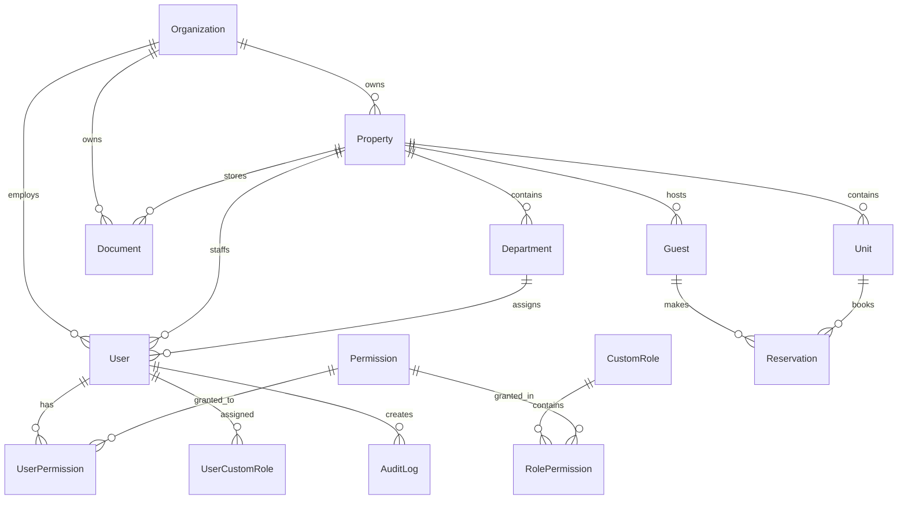

# Hotel Operations Hub - System Architecture

## Architectural Overview

Hotel Operations Hub implements a modern, multi-tenant SaaS architecture designed for hotel operations management. The system follows a Backend-for-Frontend (BFF) pattern with comprehensive permission management, supporting everything from single-property boutique hotels to large international hotel chains.

## High-Level Architecture

```
┌─────────────────────────────────────────────────────────────┐
│                     Client Layer                            │
├─────────────────────────────────────────────────────────────┤
│ React SPA (Web) │ Mobile Apps │ 3rd Party APIs │ Admin Portal│
└─────────────────┴─────────────┴─────────────────┴─────────────┘
                           │
                    ┌─────────────┐
                    │   CDN/WAF   │ (Cloudflare)
                    └─────────────┘
                           │
┌─────────────────────────────────────────────────────────────┐
│                 Railway Platform                            │
├─────────────────────────────────────────────────────────────┤
│                                                             │
│  ┌───────────────┐  ┌───────────────┐  ┌─────────────────┐  │
│  │   Frontend    │  │      BFF      │  │     Worker      │  │
│  │   (Vite)      │  │   (NestJS)    │  │   (Bull/Redis)  │  │
│  │               │  │               │  │                 │  │
│  │ - React SPA   │  │ - REST APIs   │  │ - Background    │  │
│  │ - TypeScript  │  │ - GraphQL     │  │   Jobs          │  │
│  │ - Tailwind    │  │ - WebSockets  │  │ - File Proc.    │  │
│  │ - i18n        │  │ - Auth/Perms  │  │ - Email Queue   │  │
│  └───────────────┘  └───────────────┘  └─────────────────┘  │
│                              │                              │
│  ┌─────────────────────────────────────────────────────────┐  │
│  │              Data Layer                                 │  │
│  │  ┌─────────────┐  ┌─────────────┐  ┌─────────────────┐  │  │
│  │  │ PostgreSQL  │  │    Redis    │  │  Cloudflare R2  │  │  │
│  │  │ (Primary)   │  │  (Cache)    │  │ (File Storage)  │  │  │
│  │  └─────────────┘  └─────────────┘  └─────────────────┘  │  │
│  └─────────────────────────────────────────────────────────┘  │
└─────────────────────────────────────────────────────────────┘
```

## Multi-Tenant Design Patterns

### 1. Shared Database with Tenant Isolation

**Pattern**: Single PostgreSQL database with logical tenant separation
**Implementation**: All tenant-scoped tables include `organization_id` and `property_id` columns

```sql
-- Tenant isolation at database level
CREATE TABLE users (
  id UUID PRIMARY KEY DEFAULT gen_random_uuid(),
  organization_id UUID NOT NULL REFERENCES organizations(id),
  property_id UUID REFERENCES properties(id),
  email CITEXT UNIQUE NOT NULL,
  role Role NOT NULL DEFAULT 'STAFF',
  -- other fields...
  
  -- Tenant isolation constraints
  CONSTRAINT valid_tenant_scope 
    CHECK (property_id IS NULL OR organization_id IS NOT NULL)
);

-- Composite indexes for tenant queries
CREATE INDEX idx_users_tenant ON users(organization_id, property_id, deleted_at);
CREATE INDEX idx_documents_tenant ON documents(organization_id, property_id, category);
```

### 2. Hierarchical Tenant Structure

```
Platform (Super Admin)
├── Organization (Hotel Chain/Group)
│   ├── Properties (Individual Hotels)
│   │   ├── Departments (Front Desk, Housekeeping, etc.)
│   │   │   └── Users (Staff, Managers)
│   │   └── Modules (HR, Inventory, Maintenance)
│   └── Branding (White-label Configuration)
└── System Settings (Platform Configuration)
```

### 3. Tenant Context Middleware

```typescript
@Injectable()
export class TenantContextMiddleware implements NestMiddleware {
  use(req: TenantAwareRequest, res: Response, next: NextFunction) {
    const user = req.user; // From JWT
    
    // Extract tenant context
    req.tenantContext = {
      organizationId: user.organizationId,
      propertyId: req.headers['x-property-id'] || user.primaryPropertyId,
      userId: user.id,
      role: user.role,
      permissions: user.permissions,
      departmentId: user.departmentId,
    };
    
    // Validate tenant boundaries
    if (!this.validateTenantAccess(req.tenantContext, req.path)) {
      throw new ForbiddenException('Tenant boundary violation');
    }
    
    next();
  }
}
```

## Permission System Integration

### Hybrid RBAC + ABAC Architecture

The permission system combines role-based and attribute-based access control:

```typescript
// Permission evaluation flow
async evaluatePermission(context: PermissionContext): Promise<boolean> {
  // 1. Check legacy role permissions (backwards compatibility)
  if (await this.checkLegacyRole(context.user.role, context.permission)) {
    return this.evaluateConditions(context);
  }
  
  // 2. Check custom role permissions
  for (const role of context.user.customRoles) {
    if (await this.checkRolePermission(role, context.permission)) {
      return this.evaluateConditions(context);
    }
  }
  
  // 3. Check direct user permissions (overrides)
  const userPermission = await this.getUserPermission(
    context.user.id, 
    context.permission
  );
  
  if (userPermission) {
    return userPermission.granted && this.evaluateConditions(context);
  }
  
  // 4. Default deny
  return false;
}
```

### Permission Scoping Architecture

```typescript
// Scope-based permission model
enum PermissionScope {
  PLATFORM = 'platform',      // Platform admin only
  ORGANIZATION = 'organization', // Hotel chain level
  PROPERTY = 'property',       // Individual hotel level
  DEPARTMENT = 'department',   // Department within property
  OWN = 'own'                 // Self-service only
}

// Automatic scope filtering
@Injectable()
export class ScopeFilterService {
  filterByScope<T extends TenantEntity>(
    entities: T[],
    scope: PermissionScope,
    context: TenantContext
  ): T[] {
    switch (scope) {
      case PermissionScope.PLATFORM:
        return entities; // No filtering for platform admin
        
      case PermissionScope.ORGANIZATION:
        return entities.filter(e => e.organizationId === context.organizationId);
        
      case PermissionScope.PROPERTY:
        return entities.filter(e => 
          e.organizationId === context.organizationId &&
          e.propertyId === context.propertyId
        );
        
      case PermissionScope.DEPARTMENT:
        return entities.filter(e => 
          e.organizationId === context.organizationId &&
          e.propertyId === context.propertyId &&
          e.departmentId === context.departmentId
        );
        
      case PermissionScope.OWN:
        return entities.filter(e => e.userId === context.userId);
        
      default:
        return [];
    }
  }
}
```

## Database Design & Relationships

### Core Entity Relationships



### Multi-Tenant Data Model

```typescript
// Base tenant entity
abstract class TenantEntity {
  @Column('uuid')
  organizationId: string;
  
  @Column('uuid', { nullable: true })
  propertyId?: string;
  
  @Column('timestamptz', { nullable: true })
  deletedAt?: Date;
  
  @CreateDateColumn()
  createdAt: Date;
  
  @UpdateDateColumn()
  updatedAt: Date;
}

// User entity with multi-tenant support
@Entity('users')
export class User extends TenantEntity {
  @PrimaryGeneratedColumn('uuid')
  id: string;
  
  @Column({ unique: true })
  email: string;
  
  @Column({ type: 'enum', enum: Role, default: Role.STAFF })
  role: Role;
  
  @Column('uuid', { nullable: true })
  departmentId?: string;
  
  // Permission relationships
  @OneToMany(() => UserCustomRole, ucr => ucr.user)
  customRoles: UserCustomRole[];
  
  @OneToMany(() => UserPermission, up => up.user)
  userPermissions: UserPermission[];
  
  // Tenant relationships
  @ManyToOne(() => Organization)
  @JoinColumn({ name: 'organization_id' })
  organization: Organization;
  
  @ManyToOne(() => Property)
  @JoinColumn({ name: 'property_id' })
  property?: Property;
  
  @ManyToOne(() => Department)
  @JoinColumn({ name: 'department_id' })
  department?: Department;
}
```

## API Design Patterns

### RESTful API with GraphQL Extensions

```typescript
// REST API with tenant-aware endpoints
@Controller('api/users')
@UseGuards(JwtAuthGuard, PermissionGuard)
export class UsersController {
  
  @Get()
  @RequirePermission('users.read.department')
  async findAll(@TenantContext() context: TenantContext) {
    return this.usersService.findByTenant(context);
  }
  
  @Post()
  @RequirePermission('users.create.department')
  async create(
    @Body() createUserDto: CreateUserDto,
    @TenantContext() context: TenantContext
  ) {
    return this.usersService.create(createUserDto, context);
  }
  
  @Get(':id')
  @RequirePermission('users.read.department')
  async findOne(
    @Param('id') id: string,
    @TenantContext() context: TenantContext
  ) {
    return this.usersService.findOneByTenant(id, context);
  }
}

// GraphQL resolver with permissions
@Resolver(() => User)
export class UserResolver {
  
  @Query(() => [User])
  @RequirePermission('users.read.department')
  async users(@TenantContext() context: TenantContext) {
    return this.usersService.findByTenant(context);
  }
  
  @Mutation(() => User)
  @RequirePermission('users.create.department')
  async createUser(
    @Args('input') input: CreateUserInput,
    @TenantContext() context: TenantContext
  ) {
    return this.usersService.create(input, context);
  }
}
```

### Event-Driven Architecture

```typescript
// Domain events for cross-module communication
@Injectable()
export class DomainEventBus {
  private readonly eventEmitter = new EventEmitter2();
  
  // Publish domain event
  async publish<T extends DomainEvent>(event: T): Promise<void> {
    // Add tenant context to event
    const enrichedEvent = {
      ...event,
      tenantContext: this.getCurrentTenantContext(),
      timestamp: new Date(),
      eventId: uuid(),
    };
    
    // Emit to local handlers
    this.eventEmitter.emit(event.type, enrichedEvent);
    
    // Store for audit/replay
    await this.eventStore.store(enrichedEvent);
    
    // Publish to external systems if needed
    if (event.publishExternal) {
      await this.externalEventBus.publish(enrichedEvent);
    }
  }
  
  // Subscribe to domain events
  onEvent<T extends DomainEvent>(
    eventType: string,
    handler: DomainEventHandler<T>
  ): void {
    this.eventEmitter.on(eventType, handler.handle.bind(handler));
  }
}

// Example event handlers
@EventHandler(UserCreatedEvent)
export class UserCreatedHandler implements DomainEventHandler<UserCreatedEvent> {
  async handle(event: UserCreatedEvent): Promise<void> {
    // Create default profile
    await this.profileService.createDefault(event.userId);
    
    // Send welcome email
    await this.emailService.sendWelcome(event.userEmail, event.tenantContext);
    
    // Assign default training
    await this.trainingService.assignOnboarding(event.userId);
    
    // Log audit event
    await this.auditService.logUserCreated(event);
  }
}
```

## Frontend Architecture

### Component-Based Architecture with Permission Gates

```typescript
// App.tsx - Main application structure
function App() {
  return (
    <Router>
      <AuthProvider>
        <TenantProvider>
          <PermissionProvider>
            <LanguageProvider>
              <Layout>
                <Routes>
                  <Route path="/dashboard" element={
                    <PermissionGate permission="dashboard.read.own">
                      <DashboardPage />
                    </PermissionGate>
                  } />
                  
                  <Route path="/users" element={
                    <PermissionGate permission="users.read.department">
                      <UsersPage />
                    </PermissionGate>
                  } />
                  
                  <Route path="/admin" element={
                    <PermissionGate permissions={[
                      'users.admin.property',
                      'system.admin.organization'
                    ]}>
                      <AdminPage />
                    </PermissionGate>
                  } />
                </Routes>
              </Layout>
            </LanguageProvider>
          </PermissionProvider>
        </TenantProvider>
      </AuthProvider>
    </Router>
  );
}

// Tenant context provider
export const TenantProvider: React.FC<{ children: React.ReactNode }> = ({ children }) => {
  const [currentTenant, setCurrentTenant] = useState<TenantContext | null>(null);
  const [properties, setProperties] = useState<Property[]>([]);
  
  const switchProperty = useCallback(async (propertyId: string) => {
    const newContext = await tenantService.switchProperty(propertyId);
    setCurrentTenant(newContext);
    
    // Clear cached data for new tenant context
    queryClient.clear();
    
    // Reload permissions for new context
    await permissionService.reloadPermissions();
  }, []);
  
  return (
    <TenantContext.Provider value={{
      currentTenant,
      properties,
      switchProperty,
    }}>
      {children}
    </TenantContext.Provider>
  );
};
```

### State Management with TanStack Query

```typescript
// API layer with tenant context
class ApiClient {
  private tenantContext: TenantContext | null = null;
  
  setTenantContext(context: TenantContext) {
    this.tenantContext = context;
  }
  
  async request<T>(config: RequestConfig): Promise<T> {
    const headers = {
      ...config.headers,
      'Authorization': `Bearer ${this.getToken()}`,
      'X-Organization-ID': this.tenantContext?.organizationId,
      'X-Property-ID': this.tenantContext?.propertyId,
    };
    
    return this.httpClient.request({ ...config, headers });
  }
}

// React Query with tenant-aware keys
export const useUsers = (filters?: UserFilters) => {
  const { currentTenant } = useTenant();
  
  return useQuery({
    queryKey: ['users', currentTenant?.propertyId, filters],
    queryFn: () => userService.findAll(filters),
    enabled: !!currentTenant,
    staleTime: 5 * 60 * 1000, // 5 minutes
  });
};

export const useCreateUser = () => {
  const queryClient = useQueryClient();
  const { currentTenant } = useTenant();
  
  return useMutation({
    mutationFn: userService.create,
    onSuccess: () => {
      queryClient.invalidateQueries({
        queryKey: ['users', currentTenant?.propertyId],
      });
    },
  });
};
```

## File Storage Architecture

### Tenant-Scoped Cloudflare R2 Organization

```
R2 Bucket Structure:
hotel-ops-hub-production/
├── platform/                    # Platform-level assets
│   ├── system/                  # System files
│   └── templates/               # Email/document templates
├── org-{uuid}/                  # Organization-scoped files
│   ├── shared/                  # Organization-wide files
│   │   ├── branding/           # Logos, themes
│   │   ├── policies/           # HR policies
│   │   └── templates/          # Custom templates
│   ├── property-{uuid}/        # Property-specific files
│   │   ├── documents/          # Property documents
│   │   ├── training/           # Training materials
│   │   ├── profiles/           # Staff photos
│   │   ├── payroll/           # Payroll documents
│   │   └── temp/              # Temporary uploads
│   └── property-{uuid}/       # Additional properties
└── temp/                       # Global temporary files
```

### Secure File Access Pattern

```typescript
@Injectable()
export class FileStorageService {
  
  // Generate tenant-scoped pre-signed URL
  async getPresignedUploadUrl(
    fileName: string,
    fileType: string,
    context: TenantContext,
    category: FileCategory = 'documents'
  ): Promise<PresignedUrlResponse> {
    // Validate file type and size
    this.validateFileUpload(fileName, fileType);
    
    // Build tenant-scoped path
    const key = this.buildTenantPath(fileName, context, category);
    
    // Generate pre-signed URL (5 minute expiry)
    const uploadUrl = await getSignedUrl(this.s3Client, new PutObjectCommand({
      Bucket: this.bucketName,
      Key: key,
      ContentType: fileType,
      Expires: 300,
      Metadata: {
        'uploaded-by': context.userId,
        'organization-id': context.organizationId,
        'property-id': context.propertyId || '',
        'category': category,
      },
    }));
    
    return {
      uploadUrl,
      key,
      expiresAt: new Date(Date.now() + 5 * 60 * 1000),
    };
  }
  
  // Build tenant-aware file path
  private buildTenantPath(
    fileName: string,
    context: TenantContext,
    category: FileCategory
  ): string {
    const sanitizedFileName = this.sanitizeFileName(fileName);
    const timestamp = Date.now();
    
    if (context.propertyId) {
      return `org-${context.organizationId}/property-${context.propertyId}/${category}/${timestamp}-${sanitizedFileName}`;
    } else {
      return `org-${context.organizationId}/shared/${category}/${timestamp}-${sanitizedFileName}`;
    }
  }
  
  // Secure file access with permission checking
  async getFileAccessUrl(
    fileKey: string,
    context: TenantContext
  ): Promise<string> {
    // Validate tenant access to file
    if (!this.validateTenantFileAccess(fileKey, context)) {
      throw new ForbiddenException('Access denied to file');
    }
    
    // Generate temporary access URL (1 hour expiry)
    return getSignedUrl(this.s3Client, new GetObjectCommand({
      Bucket: this.bucketName,
      Key: fileKey,
      Expires: 3600,
    }));
  }
}
```

## Security Architecture

### Multi-Layer Security Model

```typescript
// Security layers (outside to inside)
1. Cloudflare WAF/DDoS Protection
2. Railway Platform Security
3. Application-level CORS/Rate Limiting
4. JWT Authentication
5. Permission-based Authorization
6. Tenant Context Validation
7. Data-level Encryption (PII)
8. Audit Logging
```

### JWT Token with Tenant Context

```typescript
interface JwtPayload {
  sub: string;                    // User ID
  email: string;                  // User email
  role: Role;                     // Legacy role
  organizationId: string;         // Tenant organization
  propertyId?: string;           // Primary property
  departmentId?: string;         // User department
  permissions: string[];          // Cached permissions
  iat: number;                   // Issued at
  exp: number;                   // Expires at
}

@Injectable()
export class JwtStrategy extends PassportStrategy(Strategy) {
  async validate(payload: JwtPayload): Promise<User> {
    // Validate token freshness
    if (this.isTokenStale(payload)) {
      throw new UnauthorizedException('Token requires refresh');
    }
    
    // Validate tenant context
    if (!await this.validateTenantAccess(payload)) {
      throw new ForbiddenException('Invalid tenant access');
    }
    
    return {
      id: payload.sub,
      email: payload.email,
      role: payload.role,
      organizationId: payload.organizationId,
      propertyId: payload.propertyId,
      departmentId: payload.departmentId,
      permissions: payload.permissions,
    };
  }
}
```

## Performance Architecture

### Caching Strategy

```typescript
// Multi-level caching architecture
@Injectable()
export class CacheManager {
  
  // L1: Application memory cache (hot data)
  private readonly memoryCache = new Map<string, CacheEntry>();
  
  // L2: Redis cache (session data)
  constructor(private readonly redis: Redis) {}
  
  // L3: Database query result cache
  @Cacheable({ ttl: 300 }) // 5 minutes
  async getCachedQuery<T>(
    cacheKey: string,
    queryFn: () => Promise<T>
  ): Promise<T> {
    return queryFn();
  }
  
  // Permission-specific caching
  async cacheUserPermissions(
    userId: string,
    permissions: Permission[],
    ttl: number = 3600
  ): Promise<void> {
    const cacheKey = `permissions:${userId}`;
    await this.redis.setex(
      cacheKey,
      ttl,
      JSON.stringify(permissions)
    );
  }
  
  // Tenant configuration caching
  async cacheTenantConfig(
    organizationId: string,
    config: TenantConfig
  ): Promise<void> {
    const cacheKey = `tenant:${organizationId}:config`;
    await this.redis.setex(
      cacheKey,
      1800, // 30 minutes
      JSON.stringify(config)
    );
  }
}
```

### Database Query Optimization

```sql
-- Tenant-aware indexes for performance
CREATE INDEX CONCURRENTLY idx_users_tenant_active 
ON users(organization_id, property_id, deleted_at) 
WHERE deleted_at IS NULL;

CREATE INDEX CONCURRENTLY idx_permissions_user_active 
ON user_permissions(user_id, granted, is_active) 
WHERE is_active = true AND granted = true;

CREATE INDEX CONCURRENTLY idx_documents_tenant_category 
ON documents(organization_id, property_id, category, created_at DESC);

-- Composite indexes for common query patterns
CREATE INDEX CONCURRENTLY idx_audit_tenant_date 
ON audit_logs(organization_id, created_at DESC, action);

-- Partial indexes for better performance
CREATE INDEX CONCURRENTLY idx_reservations_active 
ON reservations(property_id, status, check_in_date) 
WHERE status IN ('confirmed', 'checked_in');
```

## Monitoring & Observability

### Application Monitoring

```typescript
// Structured logging with tenant context
@Injectable()
export class TenantAwareLogger {
  
  log(message: string, context?: TenantContext, extra?: object) {
    const logEntry = {
      timestamp: new Date().toISOString(),
      level: 'info',
      message,
      tenantContext: context ? {
        organizationId: context.organizationId,
        propertyId: context.propertyId,
        userId: context.userId,
      } : null,
      ...extra,
    };
    
    console.log(JSON.stringify(logEntry));
  }
  
  error(error: Error, context?: TenantContext, extra?: object) {
    const logEntry = {
      timestamp: new Date().toISOString(),
      level: 'error',
      message: error.message,
      stack: error.stack,
      tenantContext: context,
      ...extra,
    };
    
    console.error(JSON.stringify(logEntry));
  }
}

// Performance monitoring
@Injectable()
export class PerformanceMonitor {
  
  @TrackPerformance('database_query')
  async trackDatabaseQuery<T>(
    queryName: string,
    queryFn: () => Promise<T>
  ): Promise<T> {
    const start = Date.now();
    try {
      const result = await queryFn();
      const duration = Date.now() - start;
      
      this.metrics.histogram('database_query_duration', duration, {
        query_name: queryName,
        status: 'success',
      });
      
      return result;
    } catch (error) {
      const duration = Date.now() - start;
      
      this.metrics.histogram('database_query_duration', duration, {
        query_name: queryName,
        status: 'error',
      });
      
      throw error;
    }
  }
}
```

## Deployment Architecture

### Railway Multi-Service Deployment

```yaml
# railway.toml
[build]
builder = "NIXPACKS"

[deploy]
healthcheckPath = "/health"
healthcheckTimeout = 300
restartPolicyType = "ON_FAILURE"

[[services]]
name = "web"
source = "apps/bff"
variables = { NODE_ENV = "production" }

[[services]]
name = "frontend" 
source = "apps/web"
variables = { VITE_API_URL = "${{web.RAILWAY_STATIC_URL}}" }

[[services]]
name = "worker"
source = "apps/worker"
variables = { NODE_ENV = "production" }

[[services]]
name = "postgres"
template = "postgresql"

[[services]]
name = "redis"
template = "redis"
```

### Environment Configuration

```typescript
// Configuration service with validation
@Injectable()
export class ConfigService {
  
  // Database configuration
  @IsUrl()
  @IsNotEmpty()
  DATABASE_URL: string;
  
  // JWT configuration
  @IsString()
  @MinLength(32)
  JWT_SECRET: string;
  
  @IsString()
  @IsOptional()
  JWT_EXPIRES_IN: string = '15m';
  
  // Multi-tenant configuration
  @IsUUID()
  @IsOptional()
  DEFAULT_ORGANIZATION_ID?: string;
  
  @IsEnum(['strict', 'permissive'])
  @IsOptional()
  TENANT_ISOLATION_MODE: 'strict' | 'permissive' = 'strict';
  
  // Cloudflare R2 configuration
  @IsString()
  @IsNotEmpty()
  R2_ACCOUNT_ID: string;
  
  @IsString()
  @IsNotEmpty()
  R2_ACCESS_KEY_ID: string;
  
  @IsString()
  @IsNotEmpty()
  R2_SECRET_ACCESS_KEY: string;
  
  @IsString()
  @IsNotEmpty()
  R2_BUCKET_NAME: string;
  
  @IsUrl()
  @IsOptional()
  R2_PUBLIC_URL?: string;
  
  // Permission system configuration
  @IsBoolean()
  @IsOptional()
  FORCE_PERMISSION_SYSTEM: boolean = false;
  
  @IsBoolean()
  @IsOptional()
  SKIP_PERMISSION_INIT: boolean = false;
  
  @IsNumber()
  @IsOptional()
  PERMISSION_CACHE_TTL: number = 3600;
}
```

This architecture provides a solid foundation for a scalable, secure, multi-tenant hotel operations platform that can grow from single properties to international hotel chains while maintaining performance, security, and operational efficiency.

## Module Enablement Architecture (Org vs Property)

**Goal**: Allow organizations to manage modules globally while properties can override enablement/billing as needed.

**Data**:
```sql
-- module_subscriptions
organization_id UUID NOT NULL,
property_id UUID NULL,
module_id TEXT NOT NULL,
is_enabled BOOLEAN NOT NULL DEFAULT true,
UNIQUE(organization_id, module_id, property_id),
UNIQUE(organization_id, module_id) WHERE property_id IS NULL
```

**Precedence**:
1. Use `(org, module, property)` when present
2. Else inherit `(org, module, NULL)`

**API Caching**:
- Cache effective enablement per `(org, property)`; invalidate on write

## Concierge ↔ Vendors Event Flow

```mermaid
description
flowchart TD
  R[Reservation Created] --> P[Evaluate Playbooks]
  P -->|actions| CO[Create Concierge Objects]
  CO -->|vendorPolicyRef| VL[Create VendorLink]
  VL -->|send| N[Notification Worker]
  N -->|email/sms/whatsapp| V[Vendor]
  V -->|confirm/decline| EB[Event Bus]
  EB -->|vendor.confirmed| COC[Update Concierge Object]
  EB -->|vendor.declined| EX[Raise Exception]
  SLA[DueAt Reached] --> OD[Emit concierge.sla.overdue]
  OD --> TB[Today Board Exception]
```

**Notes**:
- All events enriched with tenant context (orgId, propertyId)
- Audit logging on status transitions and portal actions

## Context7 Architecture Notes

### Event Bus & Correlation
- All events carry `tenantContext` and `correlationId`
- Handlers are idempotent and side-effects guarded by dedup keys

### Worker Scheduling & Idempotency
- SLA checks use periodic scans of `dueAt` windows
- Playbook execution uses deterministic `jobId` (objectId+playbookId) to avoid duplicates

### Vendor Portal Token Exchange (Sequence)
1. User triggers send → system creates random token, stores hash with `expiresAt`, `usedAt: null`
2. Vendor opens link (GET): render portal but no action performed
3. Vendor submits action (POST): exchange token → short-lived portal JWT; mark token used
4. Portal JWT authorizes confirm/decline; emit vendor events; audit all steps