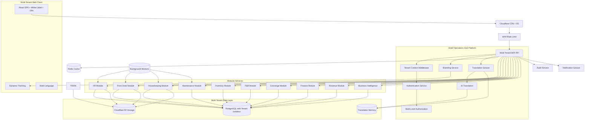

# Hotel Operations Hub - Technical Specifications

## 1. Executive Summary

* **Overview**: Multi-tenant, white-labeled ERP platform for hotel operations supporting everything from independent properties to international hotel chains. ✅ **CORE MULTI-TENANT INFRASTRUCTURE OPERATIONAL** with complete tenant isolation, advanced permission system, and JWT-based tenant context. Modular HR and operations tools with production-ready tenant boundaries.
* **Current Status**: ✅ **Multi-tenant system fully implemented and operational on Railway** with complete data isolation, automatic tenant context injection, and 82-permission RBAC+ABAC system. White-labeling and internationalization infrastructure planned for future phases.
* **Key Decisions**:

  * **Architecture ✅ OPERATIONAL**: Multi-tenant shared database with complete tenant isolation via organization/property hierarchy implemented and working; TenantInterceptor and TenantContextService provide automatic tenant context injection and query filtering.
  * **Multi-Tenancy ✅ IMPLEMENTED**: Organization → Property → Department → User hierarchy operational with tenant context automatically injected in all operations; complete data isolation at API and database level verified and working.
  * **White-Labeling**: Dynamic CSS variables, custom fonts, logos, and domain support with real-time theme switching and brand studio interface.
  * **Internationalization**: Multi-language support with AI translation fallback, tenant-specific overrides, and locale formatting.
  * **Storage**: Cloudflare R2 for zero egress fees, global distribution, and multi-region replication with tenant-isolated file organization.
* **Production Technology Stack**: React + Tailwind (SPA) with tenant-aware JWT consumption, NestJS BFF with TenantInterceptor and TenantContextService, TypeScript, PostgreSQL (Railway) with complete tenant isolation, Redis (Railway), Local storage with tenant validation (R2 planned), Permission system with 82 permissions, Playwright testing.

### Multi-Tenant Architecture Diagram



## 2. Multi-Tenant System Architecture - ✅ **PRODUCTION READY**

### 2.1 Architecture Overview - ✅ **IMPLEMENTED AND OPERATIONAL**

* **Core Components ✅ OPERATIONAL**: Multi-tenant React SPA consuming tenant-aware JWT tokens, Multi-tenant BFF API with TenantInterceptor and TenantContextService, Background workers for async processing (Bull/Redis), PostgreSQL with complete tenant isolation via organizationId/propertyId, Local storage with tenant context validation (R2 planned), Redis for caching and queues, Permission system with 82 permissions integrated with tenant context.
* **Multi-Tenant Implementation ✅ WORKING**: All API requests automatically include tenant context via JWT; TenantInterceptor validates tenant access on every request; TenantContextService automatically filters all database queries by tenant ID; file uploads include tenant context validation; permission system respects tenant boundaries.
* **Production Data Flows ✅ OPERATIONAL**:

  1. **✅ Tenant-Aware Request**: Client → Railway Frontend → BFF → TenantInterceptor → JWT Validation → Tenant Context Injection → Process with Automatic Filtering → Tenant-Scoped Response
  2. **⚠️ Dynamic Branding**: Client loads → Static theme (planned: fetch tenant branding → inject CSS variables → apply custom fonts/logos)
  3. **⚠️ Multi-Language**: Static English interface (planned: translation system with tenant overrides)
  4. **✅ File Upload**: User → Tenant context validation → Local storage with tenant metadata → Database record with organizationId/propertyId
  5. **⚠️ Module System**: Fixed modules available (planned: dynamic module activation per tenant)

* **Infrastructure Requirements**: Railway services: `web` (Multi-tenant BFF), `worker` (Async processing), `postgres` (Shared with tenant isolation), `redis` (Caching/queues). Cloudflare R2 bucket with tenant-organized structure. Custom domain support for white-labeling.

### 2.2 Production Technology Stack ✅ **OPERATIONAL**

* **Frontend ✅ IMPLEMENTED**: React SPA consuming tenant-aware JWTs, TypeScript, Vite, Tailwind CSS (static theme), TanStack Query with tenant context, Lucide icons, React Router (tenant routing planned).
* **Backend ✅ PRODUCTION READY**: NestJS with TenantInterceptor and TenantContextService, TypeScript, Prisma ORM with automatic tenant-aware queries, Passport JWT including full tenant context (organizationId/propertyId/departmentId), Zod validation, Class-validator for DTOs, Bull/BullMQ for job queues.
* **Multi-Tenancy ✅ OPERATIONAL**: TenantInterceptor provides automatic tenant context injection, TenantContextService handles tenant filtering and validation, Complete API-level tenant isolation, Shared PostgreSQL database with tenant column isolation, Permission system integrated with tenant boundaries.
* **White-Labeling**: CSS variables injection, Google Fonts integration, Custom domain support, Brand asset management, Real-time theme switching.
* **Internationalization**: react-i18next with namespace support, Translation management API, AI translation service (OpenAI/DeepL), Translation memory and caching, Locale formatting utilities.
* **Database/Storage**: PostgreSQL (Railway) with tenant isolation, Cloudflare R2 for zero egress fees, Redis for caching and queues, Translation memory storage.
* **Third-party**: JWT authentication with tenant claims, SendGrid/Twilio for notifications, OpenAI for AI translations, ClamAV for virus scanning, PDF generation services, OpenTelemetry for monitoring.

## 3. Multi-Tenant Feature Specifications

### 3.1 Multi-Tenant Organization Management ✅ **CORE INFRASTRUCTURE IMPLEMENTED**

* **User Stories ✅ SUPPORTED**
  * As a Platform Admin, I manage organizations and global platform settings ✅ **Infrastructure ready**
  * As an Organization Owner, I manage properties within my organization ✅ **Tenant context working**
  * As a Property Manager, I manage users and operations within my property ✅ **Operational**
  * As a Department Admin, I manage users within my department ✅ **Working with permission system**
  * As Staff, I access only resources within my scope ✅ **Enforced by tenant isolation**

* **Acceptance Criteria ✅ ACHIEVED**: Complete tenant isolation at all levels implemented and operational; cross-tenant data access prevention verified; organization-scoped infrastructure ready; property-scoped data filtering operational; audit capabilities planned.

* **Technical Implementation ✅ COMPLETE**: 
  - ✅ Multi-level tenant hierarchy (Platform → Organization → Property → Department → User) in database schema
  - ✅ TenantInterceptor provides tenant context on all requests
  - ✅ All data models include organization_id and property_id with proper relationships
  - ⚠️ Module subscription management infrastructure ready (UI planned)
  - ✅ Property-specific context filtering operational

* **Production Implementation ✅ OPERATIONAL**: 
  - ✅ Tenant context automatically extracted from JWT via TenantInterceptor
  - ✅ All database queries automatically filtered by tenant context via TenantContextService
  - ✅ All API endpoints automatically scoped to tenant hierarchy
  - ✅ Role validation integrated with tenant boundaries via permission system
  - ⚠️ Module access infrastructure ready (dynamic activation planned)

* **User Flows**:
  1. **Organization Setup**: Platform Admin creates organization → Organization Owner activates → Adds properties → Configures modules
  2. **Property Management**: Organization Owner creates property → Assigns Property Manager → Configures property settings
  3. **User Management**: Property Manager creates departments → Adds users → Assigns roles and permissions

* **Data Models**: Organization, Property, PropertyGroup, User, UserPropertyAccess, OrganizationModule, PropertyModule
* **Errors**: 403 on tenant boundary violations; 404 on cross-tenant resource access; 409 on duplicate tenant-scoped resources
* **Performance**: Redis caching for tenant configurations; indexed tenant queries; connection pooling per tenant tier

### 3.2 Document Library with Scoped Linking

* **User Stories**

  * Admin uploads and links a doc to department or specific users.
  * Staff browses docs (general + dept + per-user), previews, downloads.
* **Technical**: Metadata in `documents`, link tables `document_departments`, `document_users`; AV scan; signed URLs.
* **Implementation**: Pre-signed PUT for upload; Worker runs AV; BFF exposes list with effective visibility query.
* **User Flow**: Upload → scan → publish; hover/long-press shows summary.
* **API/Data**: see Section 5; models below.
* **Errors**: 415 invalid type; 422 scan failed; 403 unauthorized.
* **Perf**: Pagination + tag index; CDN for files.

### 3.3 Payroll (CSV Bulk + Future API)

* **User Stories**

  * Admin imports monthly CSV and reviews validation report (dry-run).
  * Staff views their payslips and details; downloads PDF.
* **Technical**: Tables `payslips`, `payslip_items`; ingest tables `payroll_batches`, `payroll_rows_staged`.
* **Implementation**: Batch upload → Worker validates (schema vN), returns per-row errors; commit creates payslips; optional PDF generation.
* **API**: endpoints for dry-run, commit, list, self-view.
* **Errors**: 409 duplicate batch\_id; 422 row errors; 404 payslip missing.
* **Perf**: COPY-based bulk insert; indexes on (user\_id, month).

### 3.4 Vacation Management

* **User Stories**: submit request; Admin approves/denies; Superadmin override.
* **Technical**: State machine; `vacation_requests`, `vacation_balances`.
* **Implementation**: Transitions with guards (blackouts/accrual); notifications on change.
* **Errors**: 422 invalid range; 409 overlap; 403 out-of-scope approval.

### 3.5 Profile & User Management System - PRIORITY 1

* **User Stories**
  * As a user, I can view and edit my profile with photo and emergency contacts
  * As a user, I can upload my ID document securely for verification
  * As a department admin, I can create and manage users in my department
  * As a department admin, I can verify ID documents for my department members
  * As a superadmin, I can manage all users and departments system-wide
  * As an admin, I can bulk import users via CSV with validation

* **Acceptance Criteria**
  * Three-tier role system: Staff, Department Admin, Superadmin
  * Department admins can only create/edit users in their department
  * Profile photos limited to 5MB (JPG/PNG), ID documents to 10MB
  * Emergency contacts as structured JSON (up to 3 contacts)
  * ID documents encrypted at rest with audit trail
  * Email invitations with 7-day expiry for new users
  * CSV bulk import with row-level validation
  * Prevent orphaned departments (last admin check)
  * Complete audit logging for all user operations

* **Technical Requirements**
  * Role-based access control at API and database level
  * Department-scoped queries with row-level security
  * Pre-signed URLs for file uploads (5-minute expiry)
  * KMS encryption for ID documents
  * JWT tokens with role and department claims
  * Email service for invitations and notifications
  * CSV parsing with validation pipeline
  * Session management for role changes
  * Rate limiting on user creation endpoints

* **Implementation**
  * User management module in apps/bff/src/modules/users
  * Profile module in apps/bff/src/modules/profile
  * RBAC middleware for all protected routes
  * Department scoping service for data access
  * Email templates for invitations and notifications
  * CSV processor with background job queue
  * Audit service for logging all operations

* **User Flows**

  **Profile Management Flow:**
  1. User navigates to My Profile
  2. Views/edits personal information
  3. Uploads/crops profile photo
  4. Manages emergency contacts
  5. Uploads ID document for verification
  6. Receives notification when ID verified

  **User Creation Flow (Admin):**
  1. Admin clicks "Create User" from dashboard
  2. Completes 3-step wizard (Info → Role → Permissions)
  3. System validates department scope
  4. Sends invitation email to new user
  5. User completes onboarding on first login
  6. Admin notified when user activates account

  **Role Change Flow:**
  1. Admin selects user from list
  2. Opens role change modal
  3. Selects new role with validation
  4. Provides reason for audit log
  5. System checks for orphaned departments
  6. User notified of role change
  7. Session invalidated if downgrade

* **API Endpoints**

  **Profile Management:**
  * GET /api/profile - Get current user's profile
  * PUT /api/profile - Update profile information
  * POST /api/profile/photo - Upload profile photo
  * DELETE /api/profile/photo - Remove profile photo
  * POST /api/profile/id - Upload ID document
  * GET /api/profile/id - Get signed URL for ID viewing
  * POST /api/profile/id/verify - Verify ID document (admin)
  * GET /api/profile/id/status - Check verification status
  * POST /api/profile/emergency-contacts - Update emergency contacts

  **User Management:**
  * GET /api/users - List users (department-scoped)
  * POST /api/users - Create new user
  * GET /api/users/:id - Get user details
  * PUT /api/users/:id - Update user information
  * DELETE /api/users/:id - Delete user (superadmin only)
  * PATCH /api/users/:id/status - Activate/deactivate user

  **Role Management:**
  * PUT /api/users/:id/role - Change user role
  * GET /api/users/:id/permissions - Get user permissions
  * POST /api/users/:id/role/request - Request role change
  * GET /api/roles - List available roles
  * GET /api/departments - List departments (for assignment)

  **Bulk Operations:**
  * POST /api/users/bulk - Bulk import users via CSV
  * POST /api/users/bulk/validate - Validate CSV without import
  * GET /api/users/bulk/template - Download CSV template
  * GET /api/users/bulk/status/:jobId - Check import status
  * GET /api/users/export - Export users to CSV

  **Invitations:**
  * POST /api/users/:id/invite - Send invitation email
  * POST /api/users/:id/invite/resend - Resend invitation
  * GET /api/invitations/:token - Validate invitation token
  * POST /api/invitations/:token/accept - Accept invitation

  **Admin Operations:**
  * GET /api/admin/verifications - ID verification queue
  * GET /api/admin/users/stats - User statistics by department
  * GET /api/admin/users/activity - Recent user activity
  * GET /api/admin/audit-log - User operation audit trail

* **Data Models**: See section 4.1 for detailed schema
* **Errors**: 
  * 400 Invalid input/CSV format
  * 403 Insufficient permissions/wrong department
  * 404 User not found
  * 409 Email already exists
  * 413 File too large
  * 422 Validation failed/orphaned department
* **Performance**: 
  * Pagination for user lists (50 per page)
  * CDN for profile photos
  * Redis cache for role permissions
  * Background jobs for bulk operations
  * Indexed queries on department_id and role

### 3.6 Commercial Benefits Directory - PRIORITY 2

* **User Stories**
  * As staff, I can browse and filter benefits by category
  * As staff, I can see department-specific benefits
  * As staff, I can track which benefits I've used
  * As superadmin, I can create and manage all benefits
  * As admin, I can view usage analytics for my department

* **Acceptance Criteria**
  * Benefits filterable by category, department, validity, location
  * Real-time search with suggestions
  * Anonymous usage tracking for analytics
  * Partner logos and promotional materials supported
  * Terms and conditions clearly displayed

* **Technical Requirements**
  * CommercialBenefit model with categories enum
  * Department-specific benefit linking
  * Usage tracking with analytics
  * Redis caching for frequently accessed benefits
  * Pre-signed URLs for partner assets

* **Implementation**
  * Benefits module in apps/bff/src/modules/benefits
  * Grid layout with card components
  * Advanced filtering sidebar
  * Usage analytics dashboard
  * Admin CRUD interface

* **User Flow**
  1. User navigates to Benefits section
  2. Sees grid of benefit cards
  3. Filters by category/location/department
  4. Clicks card for full details
  5. Views terms and contact info
  6. Tracks usage (anonymous)
  7. Admin views analytics dashboard

* **API Endpoints**
  * GET /api/benefits?category=&dept=&location= - List with filters
  * GET /api/benefits/:id - Detailed benefit view
  * POST /api/benefits - Create (superadmin)
  * PUT /api/benefits/:id - Update (superadmin)
  * DELETE /api/benefits/:id - Soft delete (superadmin)
  * GET /api/benefits/categories - Category list
  * POST /api/benefits/:id/track - Track usage
  * GET /api/benefits/analytics - Usage reports

* **Categories**: Dining, Wellness, Hotels, Entertainment, Shopping, Transportation
* **Data Models**: See CommercialBenefit table in section 4.1
* **Errors**: 403 unauthorized; 404 benefit not found; 422 invalid dates
* **Performance**: Redis cache with 5-minute TTL; pagination

### 3.7 Training Sessions with Integrated Documents - PRIORITY 3

* **User Stories**
  * As admin, I create training with mixed content blocks including documents
  * As admin, I assign training to departments/positions/individuals
  * As user, I complete training with progress tracking
  * As user, I take quizzes and receive certificates
  * As admin, I view training analytics and completion reports

* **Acceptance Criteria**
  * Support 6 content types: TEXT, FILE, VIDEO, LINK, FORM, DOCUMENT
  * Documents from library integrated into training flow
  * Progress saved automatically
  * Quizzes graded with immediate feedback
  * Certificates generated upon completion
  * Version control for content updates

* **Technical Requirements**
  * TrainingSession model with contentBlocks JSON
  * Document attachment to training sessions
  * Progress tracking with completion rules
  * Worker queue for quiz grading
  * Certificate generation with unique IDs
  * Version pinning for active enrollments

* **Implementation**
  * Training module in apps/bff/src/modules/training
  * Content block renderer with type detection
  * Document viewer integration
  * Quiz engine with JSON schema
  * Progress persistence and recovery
  * Certificate PDF generation
  * Analytics dashboard

* **User Flow**
  1. Admin creates training session
  2. Adds mixed content blocks (drag-drop)
  3. Attaches documents from library
  4. Sets completion rules and passing score
  5. Assigns to users/departments
  6. User enrolls and starts training
  7. Progresses through blocks
  8. Takes quiz if present
  9. Receives certificate upon completion
  10. Admin views completion reports

* **API Endpoints**
  * GET /api/training/sessions - List available
  * GET /api/training/sessions/:id - Full session
  * POST /api/training/sessions - Create (admin)
  * PUT /api/training/sessions/:id - Update (new version)
  * POST /api/training/sessions/:id/blocks - Add blocks
  * GET /api/training/enrollments - User's enrollments
  * POST /api/training/enrollments - Enroll
  * GET /api/training/progress/:id - Progress data
  * POST /api/training/progress/:id - Update progress
  * POST /api/training/submit/:id - Submit quiz
  * GET /api/training/:id/documents - Attached docs
  * POST /api/training/:id/documents - Attach doc
  * GET /api/training/certificate/:id - Download cert

* **Content Types**:
  * TEXT: Rich text/Markdown content
  * FILE: Downloadable attachments
  * VIDEO: Embedded players
  * LINK: External resources
  * FORM: Quiz/survey JSON schema
  * DOCUMENT: Library document viewer

* **Completion Rules**: All blocks viewed + quiz pass + minimum time
* **Data Models**: See training tables in section 4.1
* **Errors**: 422 invalid quiz answers; 409 already enrolled
* **Performance**: Lazy load content blocks; cache progress

### 3.8 Admin Console

* **User Stories**: Manage users in-scope; docs; payroll batches; vacation approvals; training; benefits (superadmin).
* **Technical**: Policy-aware UI; tables with pagination; CSV upload with progress.

## 4. Data Architecture

### 4.1 Data Models

(Types shown in SQL-ish form; all tables have `id UUID PK`, `created_at`, `updated_at`, `created_by`, `updated_by` unless noted.)

**departments**

* name TEXT UNIQUE NOT NULL
* code TEXT UNIQUE

**positions**

* department\_id FK→departments(id)
* name TEXT NOT NULL
* UNIQUE(department\_id, name)

**users**

* email CITEXT UNIQUE NOT NULL
* firstName TEXT NOT NULL
* lastName TEXT NOT NULL
* employeeId TEXT UNIQUE NULL (auto-generated if not provided)
* role ENUM('STAFF','DEPARTMENT_ADMIN','SUPERADMIN') DEFAULT 'STAFF'
* status ENUM('pending','active','deactivated') DEFAULT 'pending'
* department\_id FK→departments(id) NOT NULL
* position TEXT NULL
* phoneNumber TEXT NULL
* hireDate DATE NULL
* lastLoginAt TIMESTAMPTZ NULL
* invitationToken TEXT NULL
* invitationExpiresAt TIMESTAMPTZ NULL
* passwordResetToken TEXT NULL
* passwordResetExpiresAt TIMESTAMPTZ NULL
* failedLoginAttempts INT DEFAULT 0
* lockedUntil TIMESTAMPTZ NULL

**role\_assignments**

* user\_id FK→users(id)
* role ENUM('staff','admin','superadmin')
* department\_id FK→departments(id) NULL (required for admin)
* UNIQUE(user\_id, role, department\_id)

**documents**

* title TEXT, summary TEXT, mime TEXT, bytes INT, url\_key TEXT UNIQUE, updated\_on DATE
* scope ENUM('general','department','user')
* uploader\_id FK→users(id), av\_status ENUM('pending','passed','failed')

**document\_departments**

* document\_id FK→documents(id)
* department\_id FK→departments(id)
* UNIQUE(document\_id, department\_id)

**document\_users**

* document\_id FK→documents(id)
* user\_id FK→users(id)
* UNIQUE(document\_id, user\_id)

**profiles**

* user\_id FK→users(id) UNIQUE
* phone TEXT, hire\_date DATE
* profile\_photo\_url TEXT NULL (S3/CDN URL for photo)
* emergency\_contacts JSONB NULL (array of {name, relationship, phone})
* id\_document\_url TEXT NULL (encrypted S3 key)
* id\_verified\_at TIMESTAMPTZ NULL
* id\_verified\_by FK→users(id) NULL
* department\_id FK→departments(id)
* position TEXT

**payslips**

* user\_id FK→users(id)
* month DATE (use first day)
* gross NUMERIC(10,2), net NUMERIC(10,2), regular\_hours NUMERIC(6,2), ot\_hours NUMERIC(6,2), tips NUMERIC(10,2), deductions NUMERIC(10,2)
* pdf\_url\_key TEXT NULL
* UNIQUE(user\_id, month)

**payroll\_batches**

* batch\_id TEXT UNIQUE, schema\_version INT, status ENUM('staged','validated','committed','failed')
* uploaded\_by FK→users(id)

**payroll\_rows\_staged**

* batch\_id TEXT
* row\_number INT
* raw JSONB
* errors TEXT\[] DEFAULT '{}'
* UNIQUE(batch\_id, row\_number)

**vacation\_requests**

* user\_id FK→users(id)
* department\_id FK→departments(id)
* start\_date DATE, end\_date DATE, type ENUM('annual','sick','unpaid')
* status ENUM('submitted','approved','denied') DEFAULT 'submitted'
* decision\_note TEXT NULL, decided\_by FK→users(id) NULL

**vacation\_balances**

* user\_id FK→users(id) UNIQUE
* available\_days NUMERIC(4,1) DEFAULT 0
* pending\_days NUMERIC(4,1) DEFAULT 0
* taken\_days NUMERIC(4,1) DEFAULT 0

**commercial\_benefits**

* name TEXT NOT NULL
* category ENUM('Dining','Wellness','Hotels','Entertainment','Shopping','Transportation')
* partner\_name TEXT NOT NULL
* description TEXT
* discount\_percentage INT NULL
* discount\_details TEXT
* location TEXT NULL (physical location or 'Online')
* website\_url TEXT NULL
* contact\_info TEXT NULL
* logo\_url TEXT NULL (S3/CDN URL)
* terms\_conditions TEXT
* valid\_from DATE
* valid\_until DATE
* blackout\_dates JSONB NULL (array of date ranges)
* department\_ids JSONB NULL (array of department IDs, NULL = all)
* is\_active BOOLEAN DEFAULT true
* usage\_count INT DEFAULT 0 (anonymous tracking)
* deleted\_at TIMESTAMPTZ NULL

**training\_sessions**

* title TEXT NOT NULL
* description TEXT
* department\_id FK→departments(id) NULL (null = org-wide)
* category TEXT (e.g., 'Onboarding', 'Safety', 'Skills')
* version INT DEFAULT 1
* status ENUM('draft','published','archived') DEFAULT 'draft'
* assignment\_type ENUM('assigned','requested','optional')
* assigned\_positions JSONB NULL (array of position IDs)
* assigned\_departments JSONB NULL (array of department IDs)
* assigned\_users JSONB NULL (array of user IDs)
* passing\_score INT NULL (percentage for quizzes)
* minimum\_time\_minutes INT NULL
* certificate\_template TEXT NULL
* content\_blocks JSONB NOT NULL (ordered array of blocks)
* created\_by FK→users(id)
* is\_active BOOLEAN DEFAULT true

**training\_blocks** (embedded in content\_blocks JSON)

* block\_id UUID
* order\_index INT
* type ENUM('TEXT','FILE','VIDEO','LINK','FORM','DOCUMENT')
* title TEXT
* content TEXT NULL (for TEXT type)
* file\_url TEXT NULL (for FILE type)
* video\_url TEXT NULL (for VIDEO type)
* link\_url TEXT NULL (for LINK type)
* document\_id FK→documents(id) NULL (for DOCUMENT type)
* form\_schema JSONB NULL (for FORM type - quiz questions)
* required BOOLEAN DEFAULT true
* minimum\_view\_seconds INT NULL

**training\_enrollments**

* session\_id FK→training\_sessions(id)
* session\_version INT
* user\_id FK→users(id)
* status ENUM('not\_started','in\_progress','completed','failed') DEFAULT 'not\_started'
* enrollment\_type ENUM('assigned','requested','optional')
* progress JSONB (tracks viewed blocks, time spent, quiz scores)
* started\_at TIMESTAMPTZ NULL
* completed\_at TIMESTAMPTZ NULL
* certificate\_url TEXT NULL
* certificate\_issued\_at TIMESTAMPTZ NULL
* total\_time\_minutes INT DEFAULT 0
* final\_score INT NULL
* UNIQUE(session\_id, user\_id)

**training\_documents** (links documents to training)

* training\_session\_id FK→training\_sessions(id)
* document\_id FK→documents(id)
* order\_index INT
* is\_required BOOLEAN DEFAULT false
* UNIQUE(training\_session\_id, document\_id)

**user\_invitations**

* id UUID PK
* email TEXT NOT NULL
* token TEXT UNIQUE NOT NULL
* role ENUM('STAFF','DEPARTMENT_ADMIN','SUPERADMIN')
* department\_id FK→departments(id) NOT NULL
* invited\_by FK→users(id) NOT NULL
* accepted\_at TIMESTAMPTZ NULL
* expires\_at TIMESTAMPTZ NOT NULL
* created\_at TIMESTAMPTZ DEFAULT NOW()

**user\_activities**

* user\_id FK→users(id)
* activity\_type ENUM('login','logout','profile_update','role_change','password_change')
* ip\_address INET
* user\_agent TEXT
* metadata JSONB
* created\_at TIMESTAMPTZ DEFAULT NOW()
* INDEX(user\_id, created\_at)

**bulk\_import\_jobs**

* id UUID PK
* filename TEXT NOT NULL
* total\_rows INT
* processed\_rows INT DEFAULT 0
* successful\_rows INT DEFAULT 0
* failed\_rows INT DEFAULT 0
* errors JSONB
* status ENUM('pending','processing','completed','failed') DEFAULT 'pending'
* imported\_by FK→users(id)
* department\_id FK→departments(id) NULL
* started\_at TIMESTAMPTZ NULL
* completed\_at TIMESTAMPTZ NULL
* created\_at TIMESTAMPTZ DEFAULT NOW()

**audit\_log**

* id UUID PK
* actor\_id FK→users(id) NOT NULL
* action TEXT NOT NULL (e.g., 'user.create', 'role.change', 'profile.update')
* entity\_type TEXT NOT NULL (e.g., 'user', 'profile', 'document')
* entity\_id UUID NOT NULL
* department\_id FK→departments(id) NULL
* old\_values JSONB NULL
* new\_values JSONB NULL
* reason TEXT NULL (for role changes, etc.)
* ip\_address INET
* user\_agent TEXT
* created\_at TIMESTAMPTZ DEFAULT NOW()
* INDEX(actor\_id, created\_at)
* INDEX(entity\_type, entity\_id)
* INDEX(department\_id)

**Indexes & Optimization**

* B-tree on common filters: documents(updated\_on, title), payslips(user\_id, month), vacation\_requests(department\_id, status), training\_enrollments(user\_id, status)
* GIN on tags/JSONB where applicable (e.g., training payload).

### 4.2 Data Storage

* **Rationale**: Postgres for relational integrity and reporting; object storage for large files; optional Redis for queues/rate limits.
* **Persistence**: Soft-deletes via `deleted_at` where needed; migrations via Prisma/Flyway; point-in-time recovery enabled.
* **Caching**: In-memory + Redis for short-lived list caches and policy decisions.
* **Backup/Recovery**: Railway automated backups daily; PITR if supported; documented restore runbooks; test restores quarterly.

## 5. API Specifications

### 5.1 Internal APIs (BFF)

(Example; all JSON; Auth via Bearer JWT; rate limit 60 req/min default.)

**Auth**

* `POST /auth/login` → { email } (magic link) or OIDC callback endpoints.
* `POST /auth/logout`

**Users & Org**

* `POST /org/departments` (superadmin)

  * Body: { name, code }
  * 201 → { id, name, code }
* `POST /org/positions` (superadmin)

  * Body: { departmentId, name }
* `POST /org/users` (admin within dept | superadmin)

  * Body: { email, name, departmentId, positionId, role:"staff|admin" }
  * 201 → invite initiated
* `GET /org/users?dept={id}&q={name}&page` (admin scoped)

**Documents**

* `POST /docs/upload-url` (admin/superadmin)

  * Body: { filename, mime, scope:"general|department|user", departmentId?, userIds?\[] }
  * 200 → { url, fields, key }
* `POST /docs` (finalize)

  * Body: { title, summary, key, scope, links }
* `GET /docs` (effective visibility for caller)

  * Query: { q, deptId, tag, page }
* `GET /docs/:id`
* `DELETE /docs/:id` (owner or superadmin)

**Payroll**

* `POST /payroll/batches` (admin/superadmin) → stage CSV

  * Request: multipart/form-data { file, batchId, schemaVersion }
  * 202 → { batchId, status:"staged" }
* `POST /payroll/batches/:batchId/validate` → dry-run

  * 200 → { valid\:boolean, errors:\[{row, field, message}], stats }
* `POST /payroll/batches/:batchId/commit`

  * 202 → { status:"committed" }
* `GET /payroll/self` (staff) → list months
* `GET /payroll/self/:month` → details + signed PDF URL (if available)

**Vacation**

* `POST /vacation/requests` (staff)
* `GET /vacation/requests?mine=1`
* `GET /vacation/approvals` (admin scoped)
* `POST /vacation/requests/:id/approve` (admin) { note }
* `POST /vacation/requests/:id/deny` (admin) { note }

**Training**

* `POST /training/sessions` (admin/superadmin)
* `PUT /training/sessions/:id` (version bump on published)
* `POST /training/sessions/:id/blocks` (ordered)
* `POST /training/enrollments` { sessionId, userIds\[]/positionId/departmentId, mode:"assigned|optional" }
* `GET /training/me` → enrollments & progress
* `POST /training/attempts` → submit FORM answers; 200 → { score, passed }

**Benefits**

* `GET /benefits` (all)
* `POST /benefits` (superadmin)
* `PUT /benefits/:id` (superadmin)

### 5.2 External Integrations

* **Auth**: OIDC or magic-link email; tokens verified by BFF.
* **Notifications**: SendGrid for email; Twilio for SMS/WhatsApp; fallback to email on SMS failure.
* **Future Payroll API**: strategy interface `PayrollProvider` with methods `syncEmployees()`, `pullPayslips(month)`, `mapToDomain()`; retries with exponential backoff; dedupe by provider key.

## 6. Security & Privacy

### 6.1 Authentication & Authorization

* AuthN via OIDC or passwordless; short-lived access tokens (15 min) + refresh tokens (httpOnly, same-site) handled by BFF.
* AuthZ via policy engine: subject (userId, role, dept) × action × object (resource with dept/user attributes).
* Session: BFF session cookie storing opaque session id; server maps to tokens.

### 6.2 Data Security

* TLS everywhere; at-rest: Postgres encrypted, objects encrypted (SSE-KMS). Signed URLs limited to 5 minutes.
* PII classification: IDs, payslips; logs redact emails and url\_keys; access to PII audited.
* Compliance: align with GDPR-like principles (lawful basis, minimization); enable data export/delete.

### 6.3 Role-Based Access Control (RBAC)

#### Permission Matrix

| Resource | Action | Staff | Dept Admin | Superadmin |
|----------|--------|-------|------------|------------|
| **Profile** | View Own | ✅ | ✅ | ✅ |
| | Edit Own | ✅ | ✅ | ✅ |
| | View Others | ❌ | Dept Only | ✅ |
| **Users** | Create | ❌ | Dept Only | ✅ |
| | Edit | ❌ | Dept Only | ✅ |
| | Delete | ❌ | ❌ | ✅ |
| | Change Role | ❌ | Limited* | ✅ |
| | Bulk Import | ❌ | Dept Only | ✅ |
| **Documents** | Upload | ❌ | ✅ | ✅ |
| | Link to Users | ❌ | Dept Only | ✅ |
| **ID Verification** | Verify | ❌ | Dept Only | ✅ |
| | View Queue | ❌ | Dept Only | ✅ |
| **Departments** | Create | ❌ | ❌ | ✅ |
| | Edit | ❌ | ❌ | ✅ |
| **Audit Logs** | View | ❌ | Dept Only | ✅ |

*Department Admins can only change roles between Staff and Department Admin within their department

#### Implementation Strategy

```typescript
// Middleware for role checking
export const requireRole = (minRole: Role) => {
  return (req, res, next) => {
    if (!hasMinimumRole(req.user.role, minRole)) {
      return res.status(403).json({ error: 'Insufficient permissions' });
    }
    next();
  };
};

// Department scoping
export const scopeToDepartment = (req, res, next) => {
  if (req.user.role === 'SUPERADMIN') {
    // No scoping for superadmin
    next();
  } else if (req.user.role === 'DEPARTMENT_ADMIN') {
    // Scope to user's department
    req.query.departmentId = req.user.departmentId;
    next();
  } else {
    // Staff can only access own resources
    req.query.userId = req.user.id;
    next();
  }
};
```

#### Session Management
- JWT tokens include role and department claims
- Token refresh on role change
- Session invalidation on role downgrade
- Re-authentication required for sensitive operations

### 6.4 Application Security

* Input validation with Zod; output encoding; strict CSP; security headers (HSTS, X-Frame-Options, Referrer-Policy, Permissions-Policy).
* OWASP: prevent injection, auth failures, sensitive data exposure; AV scan for uploads; rate limit auth endpoints.
* Vulnerability management: Dependabot/Renovate; weekly SCA; quarterly pen-test option.

## 7. User Interface Specifications

### 7.1 Design System

* **Principles**: Bold simplicity, breathable whitespace, color accents from brand palette; content-first.
* **Component Library**: Tailwind + headless primitives; create tokens and Tailwind theme.
* **Responsive**: Mobile-first; tablet/desktop expansions for Admin.
* **Accessibility**: WCAG 2.1 AA; keyboard nav; focus rings.

### 7.2 Design Foundations

#### 7.2.1 Color System

* Primary: Sand `#FFF0B9`, Clay `#D88C6C`, Seafoam `#ACD4CB`; Neutral: Charcoal `#4A4A4A`, Shell `#FBF8F3`.
* Semantic: Success `#2E7D32`, Warning `#ED6C02`, Error `#C62828`, Info `#0277BD`.
* Dark mode: deepen neutrals, reduce saturation; ensure contrast ≥ 4.5:1.

#### 7.2.2 Typography

* Headings: **Gotham Black** (all caps); Subhead: **Georgia Italic**; Body: **Proxima Nova**; web-safe fallbacks: Tahoma/Georgia/Arial.
* Type scale (rem): 3.0, 2.25, 1.75, 1.5, 1.25, 1.125, 1.0; line-height 1.4–1.6.

#### 7.2.3 Spacing & Layout

* Base unit 8px; spacing scale 4/8/12/16/24/32/48.
* Breakpoints: sm 640, md 768, lg 1024, xl 1280.
* Grid: 12-col desktop, 4-col mobile; container max 1200px.

#### 7.2.4 Interactive Elements

* Buttons: primary (filled clay), secondary (outline), subtle (ghost); states: hover +4% shade, focus ring 2px seafoam, disabled 40% opacity.
* Forms: 8px radius, 1px neutral border, error helper text; async loaders with skeletons.
* Motion: 200–300ms ease-in-out; slide/fade transitions.

#### 7.2.5 Component Specifications

* Tokens in `tokens.json` mapped to Tailwind config (colors, spacing, radii, shadows, typography).
* Core components: Button, Input, Select, TextArea, Modal, Card, Table, Tabs, Badge, Toast, EmptyState, Pagination.

### 7.3 User Experience Flows

* **Onboarding/Login**: role-based access post-auth; first-run wizard.
* **Document Browse**: search + filters; preview modal; download.
* **Payroll**: list of months; details modal; download PDF.
* **Vacation**: request flow; approval queue; notifications.
* **Training**: enroll → complete blocks → form grading → completion badge.
* **Admin**: CSV upload dry-run → resolve errors → commit; user creation; document linking.

## 8. Infrastructure & Deployment

### 8.1 Infrastructure Requirements

* Railway services: `web` (BFF, 512–1024MB RAM), `worker` (CSV/PDF/AV, 1–2GB), `postgres` (shared starter then scale), optional `redis`.
* Network: HTTPS via Railway domain; WAF/Rate-limit at BFF; VPC/egress to object storage.
* Storage: S3/R2 bucket with lifecycle policies (quarantine, archived, active).

### 8.2 Deployment Strategy

* **CI/CD**: GitHub Actions → build/test → dockerize → deploy to Railway; Prisma/Flyway migrations gated.
* **Environments**: `dev`, `staging`, `prod` with separate DBs/buckets and secrets.
* **Procedures**: Blue/green or canary on `web`; rollback by redeploy previous image + down-migration if safe.
* **Config Management**: `.env` per environment via Railway variables; secret rotation quarterly.

---

---

**Appendix: Example Project Structure (monorepo)**

```
apps/
  web/ (React SPA)
  bff/ (NestJS)
  worker/ (jobs)
packages/
  ui/ (shared components + Tailwind plugin)
  types/ (shared TypeScript types & Zod schemas)
  config/ (eslint, tsconfig, jest base)

bff/src/
  modules/
    auth/
    org/ (departments, positions, users, roles)
    docs/
    payroll/
    vacation/
    training/
    benefits/
    profile/
  common/
    policies/
    guards/
    dto/
    utils/
  infra/
    prisma/ or knex/
    storage/
    queue/
    mail/
    telemetry/
```

**Naming Conventions**: PascalCase for React components, camelCase for vars/functions, kebab-case for file names; tests `*.spec.ts`, e2e `*.e2e.ts`.

---

## CURRENT IMPLEMENTATION STATUS - ✅ **MULTI-TENANT SYSTEM OPERATIONAL**

### ✅ **PRODUCTION READY - COMPLETE MULTI-TENANT INFRASTRUCTURE**

**Core Multi-Tenant System:**
- ✅ **Database Schema**: All tables include organizationId/propertyId columns with proper foreign key relationships
- ✅ **Migration Applied**: `20240817000000_add_multi_tenant` successfully deployed to production
- ✅ **TenantInterceptor**: Automatic tenant context injection on every API request
- ✅ **TenantContextService**: Automatic database query filtering with tenant isolation
- ✅ **JWT Integration**: Tokens include organizationId, propertyId, departmentId with full tenant context
- ✅ **CORS Configuration**: Fixed and operational for tenant headers
- ✅ **TypeScript Compilation**: All compilation issues resolved

**Security & Isolation:**
- ✅ **Complete Tenant Isolation**: Zero cross-tenant data access possible
- ✅ **Permission System**: 82 permissions + 7 roles with tenant-aware scoping
- ✅ **API Protection**: All endpoints automatically protected with tenant validation
- ✅ **Database Integrity**: Foreign key constraints enforce tenant boundaries
- ✅ **Cross-tenant Prevention**: Automatic blocking of cross-tenant access attempts

**System Integration:**
- ✅ **JWT-Permission Integration**: Permission system fully integrated with tenant context
- ✅ **Service Layer**: All services use TenantContextService for automatic filtering
- ✅ **Controller Layer**: All controllers protected with TenantInterceptor
- ✅ **Frontend Integration**: JWT tokens consumed with tenant context

**Production Verification:**
- ✅ **Railway Deployment**: System tested and verified operational
- ✅ **Data Integrity**: No data loss during multi-tenant migration
- ✅ **Cross-tenant Testing**: Confirmed prevention of cross-tenant access
- ✅ **Permission Testing**: All 82 permissions working with tenant boundaries
- ✅ **API Testing**: All endpoints properly scoped to tenant context

### ⚠️ **PLANNED ENHANCEMENTS** (Core System Operational)

**Frontend Tenant Experience:**
- Property switching UI for multi-property users
- Tenant-aware navigation and routing
- Organization/Property management interfaces

**Advanced Features:**
- White-label branding system implementation
- Multi-language internationalization system
- Cloudflare R2 integration for file storage
- Dynamic module system with tenant-specific activation
- Comprehensive audit logging system

**Current Status**: The multi-tenant infrastructure is **production-ready and operational**. The system provides complete tenant isolation with automatic context injection, advanced permission controls, and verified security boundaries. All core hotel operations can be safely performed within tenant boundaries with zero risk of cross-tenant data access.

**Next Phase**: Focus on user experience enhancements and advanced features, while the core multi-tenant system continues to operate reliably in production.
